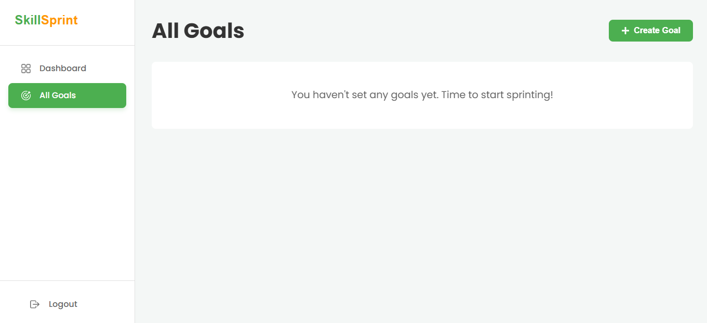

# SkillSprint - A Full-Stack Task and Learning Tracker

A beautiful and fully functional web application designed to help users structure and accelerate their learning process. Built with the **React, Node.js, and PostgreSQL**, this API-first project showcases a modern, feature-rich web experience focused on turning ambitions into achievements.

### **[View Live Demo](https://skill-sprint-gilt.vercel.app/)**

---

## Features

This application is packed with features that create a complete and motivational user journey:

*   **Secure JWT Authentication:** Full user registration and login flow, with sessions managed securely using **JSON Web Tokens**. Passwords are encrypted with `bcrypt`.
*   **Dynamic Dashboard:** A central hub that visualizes all user-created learning goals in a clean, organized grid layout.
*   **Full CRUD for Goals:** Users can Create, Read, Update, and Delete their learning goals through an intuitive modal interface.
*   **Goal Status Tracking:** Dynamically update the status of any goal ("Not Started," "In Progress," "Completed") to visually track progress.
*   **Decoupled & Scalable Architecture:** A professional **monorepo** structure separating the frontend (React SPA) from the backend (Node.js REST API).
*   **ORM & Database Migrations:** Uses **Sequelize** as an ORM to provide a safe and structured way to interact with the PostgreSQL database. Database schema changes are managed with migration files.
*   **Protected API Routes:** Backend routes are protected using custom middleware, ensuring users can only access and modify their own data.
*   **CI/CD Deployment:** A production-ready deployment pipeline with the frontend hosted on **Vercel** and the backend/database on **Railway**.
*   **Elegant & Responsive UI:** A clean, modern interface built with a centralized, scalable CSS theme and professional layout.

---

## Tech Stack & Tools

This project leverages a modern and powerful set of tools to deliver a high-quality, full-stack web application.

| Category          | Technology / Tool                                                                                                                                                                                                                                                                                       |
| ----------------- | ------------------------------------------------------------------------------------------------------------------------------------------------------------------------------------------------------------------------------------------------------------------------------------------------------- |
| **Frontend**      |                                                                                                      |
| **Backend**       |                                                                             |
| **Database**      |  &                                                                      |
| **Navigation**    |                                                                                                                                                                                       |
| **Deployment**    |  &                                                                                                   |
| **Styling**       | **Pure CSS** (with a scalable variable-based theme)                                                                                                                                                                                                                                                       |
| **Version Control** |  &                                                                                                                 |
| **API Client**    |                                                                                                                                                                                                             |

---


## Screenshots

| Login | Signup |
|:-----:|:------:|
|  |  |

| Dashboard | Preview Goal |
|:---------:|:------------:|
|  |  |

| Create Goal | Edit Goal |
|:-----------:|:---------:|
|  |  |

---

## Getting Started

To run this project locally, follow these steps:

### Prerequisites

*   Node.js (LTS version, v18+)
*   Git
*   A running instance of PostgreSQL

### 1. Clone the Repository

```bash
git clone https://github.com/your-username/your-repo-name.git
cd your-repo-name

### 2. Set Up The Backend

1.  Navigate into the backend project:
    ```bash
    cd skillsprint-backend
    ```
2.  Install all required packages:
    ```bash
    npm install
    ```
3.  Create your local environment file. In the `skillsprint-backend` folder, create a file named `.env`.
4.  Paste the following into this new file, replacing the placeholder values with your local PostgreSQL credentials. **(This file is in `.gitignore` to protect your keys!)**
    ```dotenv
    PORT=3000

    DB_HOST=localhost
    DB_USER=your_postgres_user
    DB_PASSWORD=your_postgres_password
    DB_NAME=skillsprint_dev

    JWT_SECRET=generate_a_strong_random_secret_for_local_use
    ```
5.  Make sure your PostgreSQL server is running and you have created a database named `skillsprint_dev`.
6.  Run the database migrations to create all necessary tables:
    ```bash
    npx sequelize-cli db:migrate
    ```

### 3. Set Up The Frontend

1.  From the root directory, navigate into the frontend project:
    ```bash
    cd ../skillsprint-frontend
    ```
2.  Install all required packages:
    ```bash
    npm install
    ```

### 4. Run the Application

You will need two separate terminals to run both the backend and frontend servers simultaneously.

*   **Terminal 1 (Backend):**
    ```bash
    cd skillsprint-backend
    npm run dev
    ```

*   **Terminal 2 (Frontend):**
    ```bash
    cd skillsprint-frontend
    npm run dev
    ```
Open `http://localhost:5173` (or whatever port is shown) in your browser.

---

## Key Learnings & Future Improvements

This project was an excellent exercise in building a full-stack application from scratch, covering everything from database design to production deployment. Key takeaways include:

*   **Monorepo Management:** Structuring and managing a full-stack application within a single Git repository.
*   **Secure API Design:** Implementing JWT authentication and protected routes with custom middleware.
*   **Database Schema & Migrations:** Using Sequelize to define models and manage database schema evolution safely.
*   **Modern Deployment Pipelines:** Configuring and deploying separate frontend and backend services on Vercel and Railway, and troubleshooting real-world CORS and environment issues.

### Future Ideas:

*   [ ] **Task Management:** Implement full CRUD functionality for sub-tasks within each goal.
*   [ ] **Daily Progress Logging:** Add a feature to log daily notes and hours spent on each goal.
*   [ ] **AI-Powered Suggestions:** Integrate an AI service to provide weekly feedback based on user activity.
*   [ ] **Advanced Data Visualization:** Add more charts to the dashboard to show progress over time.

---

## Author

**Zainab Malik**

*   GitHub: [@zaina-601](https://github.com/zaina-601/SkillSprint)

```